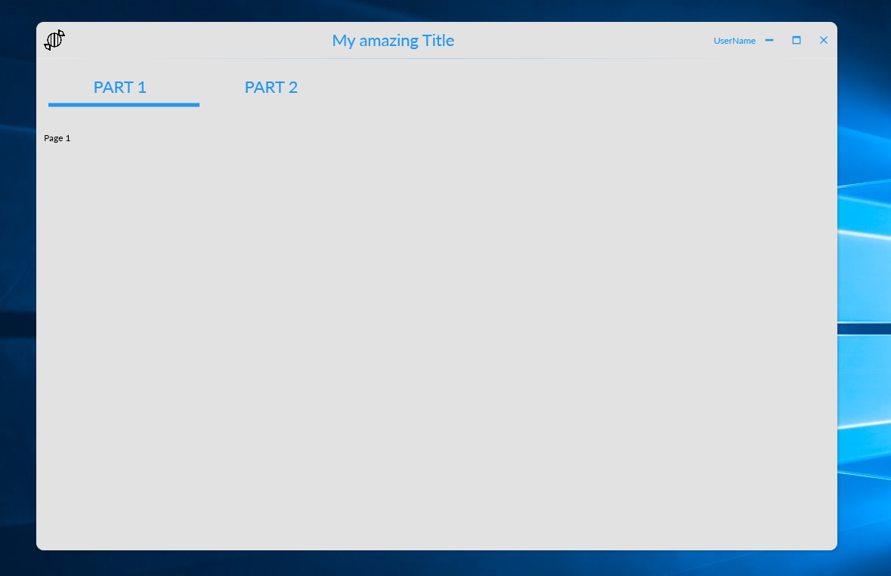

# Modern WPF UI Template

## Features
- Simple head menu management
- Page Management (2 pages)
- Full custom windows
- Native MVVM Managment

## Include
- MaterialDesignInXamlToolkit : UI standards google components
- Fody : Dependancy injection
- Microsoft.Windows.Shell : Provice Windows Chrome integration

